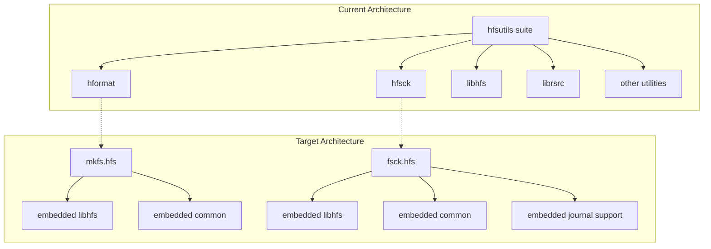

# Design Document

## Overview

This design document outlines the separation of `hformat` and `hfsck` utilities from the hfsutils suite into independent `mkfs.hfs` and `fsck.hfs` tools. The design focuses on creating standalone executables that embed necessary dependencies while maintaining full compatibility with existing functionality and following Unix/Linux filesystem utility conventions.

## Architecture

### High-Level Architecture



### Dependency Analysis

**Current Dependencies:**
- **hformat**: libhfs, hfsutil common code, suid utilities, HFS+ format support
- **hfsck**: libhfs, journal support, volume checking logic, suid utilities

**Target Dependencies:**
- **mkfs.hfs**: Embedded libhfs subset, HFS/HFS+ formatting logic, device detection
- **fsck.hfs**: Embedded libhfs subset, journal replay logic, volume repair logic

## Components and Interfaces

### 1. mkfs.hfs Component

**Purpose**: Standalone HFS/HFS+ filesystem creation utility

**Key Features:**
- Support for both HFS and HFS+ filesystem creation
- Automatic filesystem type detection based on program name
- Standard mkfs command-line interface
- Embedded dependencies for standalone operation

**Interface Design:**
```c
// Main entry point
int main(int argc, char *argv[]);

// Core formatting functions
int mkfs_hfs_format(const char *device, const mkfs_options_t *opts);
int mkfs_hfsplus_format(const char *device, const mkfs_options_t *opts);

// Options structure
typedef struct {
    char *device_path;
    char *volume_name;
    int filesystem_type;  // 0=auto, 1=HFS, 2=HFS+
    int force;
    int verbose;
    size_t block_size;
    size_t total_size;
} mkfs_options_t;
```

**Command-line Interface:**
```bash
mkfs.hfs [-f] [-l label] [-t type] [-v] device [partition-no]
mkfs.hfs+ [-f] [-l label] [-v] device [partition-no]
mkfs.hfsplus [-f] [-l label] [-v] device [partition-no]
```

### 2. fsck.hfs Component

**Purpose**: Standalone HFS/HFS+ filesystem checking and repair utility

**Key Features:**
- Support for both HFS and HFS+ filesystem checking
- HFS+ journal replay and management
- Standard fsck command-line interface
- Embedded dependencies for standalone operation

**Interface Design:**
```c
// Main entry point
int main(int argc, char *argv[]);

// Core checking functions
int fsck_hfs_check(const char *device, const fsck_options_t *opts);
int fsck_hfsplus_check(const char *device, const fsck_options_t *opts);

// Journal management
int journal_replay(int fd, struct HFSPlus_VolumeHeader *vh, int repair_mode);
int journal_is_valid(int fd, struct HFSPlus_VolumeHeader *vh);
int journal_disable(int fd, struct HFSPlus_VolumeHeader *vh);

// Options structure
typedef struct {
    char *device_path;
    int partition_number;
    int verbose;
    int no_write;
    int auto_repair;
    int force;
} fsck_options_t;
```

**Command-line Interface:**
```bash
fsck.hfs [-v] [-n] [-a] [-f] [-y] device [partition-no]
fsck.hfs+ [-v] [-n] [-a] [-f] [-y] device [partition-no]
fsck.hfsplus [-v] [-n] [-a] [-f] [-y] device [partition-no]
```

### 3. mount.hfs Component

**Purpose**: Standalone HFS/HFS+ filesystem mounting utility

**Key Features:**
- Support for both HFS and HFS+ filesystem mounting
- Integration with system mount infrastructure
- Standard mount command-line interface
- Embedded dependencies for standalone operation

**Interface Design:**
```c
// Main entry point
int main(int argc, char *argv[]);

// Core mounting functions
int mount_hfs_filesystem(const char *device, const char *mountpoint, const mount_options_t *opts);
int mount_hfsplus_filesystem(const char *device, const char *mountpoint, const mount_options_t *opts);

// Options structure
typedef struct {
    char *device_path;
    char *mount_point;
    int filesystem_type;  // 0=auto, 1=HFS, 2=HFS+
    int read_only;
    int verbose;
    char *mount_options;
} mount_options_t;
```

**Command-line Interface:**
```bash
mount.hfs [-r] [-v] [-o options] device mountpoint
mount.hfs+ [-r] [-v] [-o options] device mountpoint
mount.hfsplus [-r] [-v] [-o options] device mountpoint
```

### 4. Embedded Library Components

**libhfs Subset:**
- Core HFS volume operations
- Block and node management
- B-tree operations
- Device I/O abstraction

**Common Utilities:**
- SUID privilege management
- Device detection and partitioning
- Error handling and reporting
- Version information

**HFS+ Extensions:**
- Journal support and replay
- HFS+ volume header management
- Extended attributes support
- Case-sensitive filename handling

## Data Models

### 1. Filesystem Type Detection

```c
typedef enum {
    FS_TYPE_UNKNOWN = 0,
    FS_TYPE_HFS = 1,
    FS_TYPE_HFSPLUS = 2,
    FS_TYPE_HFSX = 3
} hfs_fs_type_t;

// Detection function
hfs_fs_type_t hfs_detect_fs_type(int fd);
```

### 2. Volume Information Structure

```c
typedef struct {
    char volume_name[256];
    hfs_fs_type_t fs_type;
    uint32_t block_size;
    uint64_t total_blocks;
    uint64_t free_blocks;
    uint32_t attributes;
    int has_journal;
} volume_info_t;
```

### 3. Build Configuration

```c
typedef struct {
    char *source_files[MAX_FILES];
    char *include_paths[MAX_PATHS];
    char *library_paths[MAX_PATHS];
    char *libraries[MAX_LIBS];
    char *defines[MAX_DEFINES];
} build_config_t;
```

## Error Handling

### Exit Code Standards

**mkfs.hfs Exit Codes:**
- 0: Success
- 1: General error
- 2: Usage error
- 4: Operational error
- 8: System error

**fsck.hfs Exit Codes:**
- 0: No errors found
- 1: Errors found and corrected
- 2: System should be rebooted
- 4: Errors found but not corrected
- 8: Operational error
- 16: Usage or syntax error
- 32: fsck canceled by user request
- 128: Shared library error

### Error Reporting Strategy

1. **Consistent Error Messages**: Use standard Unix error reporting patterns
2. **Verbose Mode Support**: Provide detailed information when requested
3. **Graceful Degradation**: Handle missing features or permissions appropriately
4. **Journal Error Handling**: Specific handling for HFS+ journal corruption

## Testing Strategy

### 1. Unit Testing

**mkfs.hfs Tests:**
- Filesystem creation with various parameters
- Device detection and validation
- Error condition handling
- Command-line parsing

**fsck.hfs Tests:**
- Filesystem checking accuracy
- Journal replay functionality
- Repair operation validation
- Error detection and reporting

### 2. Integration Testing

**Cross-Platform Testing:**
- Linux distributions (Ubuntu, CentOS, Arch)
- BSD systems (FreeBSD, OpenBSD)
- macOS compatibility verification

**Filesystem Testing:**
- Various device types (files, block devices, partitions)
- Different filesystem sizes and configurations
- Corrupted filesystem recovery scenarios

### 3. Compatibility Testing

**Legacy Compatibility:**
- Existing script compatibility
- Command-line option preservation
- Output format consistency
- Mount/unmount integration

## Build System Design

### 1. Makefile Targets

```makefile
# New standalone targets
mkfs.hfs: $(MKFS_OBJECTS) $(EMBEDDED_LIBHFS)
	$(CC) $(LDFLAGS) -o $@ $^ $(LIBS)

fsck.hfs: $(FSCK_OBJECTS) $(EMBEDDED_LIBHFS)
	$(CC) $(LDFLAGS) -o $@ $^ $(LIBS)

# Embedded library target
$(EMBEDDED_LIBHFS): $(LIBHFS_SUBSET_OBJECTS)
	$(AR) rcs $@ $^
```

### 2. Source File Organization

```
src/
├── mkfs/
│   ├── mkfs_main.c          # Main entry point for mkfs.hfs
│   ├── hfs_format.c         # HFS formatting logic
│   ├── hfsplus_format.c     # HFS+ formatting logic
│   └── mkfs_common.c        # Common formatting utilities
├── fsck/
│   ├── fsck_main.c          # Main entry point for fsck.hfs
│   ├── hfs_check.c          # HFS checking logic
│   ├── hfsplus_check.c      # HFS+ checking logic
│   ├── journal.c            # Journal management
│   └── fsck_common.c        # Common checking utilities
├── mount/
│   ├── mount_main.c         # Main entry point for mount.hfs
│   ├── hfs_mount.c          # HFS mounting logic
│   ├── hfsplus_mount.c      # HFS+ mounting logic
│   └── mount_common.c       # Common mounting utilities
└── embedded/
    ├── libhfs_subset/       # Minimal libhfs implementation
    ├── common/              # Shared utilities
    └── suid/                # Privilege management
```

### 3. Installation Strategy

**Flexible Installation Targets:**
```makefile
# Linux-specific installation (filesystem utilities only)
install-linux: mkfs.hfs fsck.hfs mount.hfs
	$(INSTALL) -d $(DESTDIR)$(SBINDIR)
	$(INSTALL) -m 755 mkfs.hfs $(DESTDIR)$(SBINDIR)/
	$(INSTALL) -m 755 fsck.hfs $(DESTDIR)$(SBINDIR)/
	$(INSTALL) -m 755 mount.hfs $(DESTDIR)$(SBINDIR)/
	ln -sf mkfs.hfs $(DESTDIR)$(SBINDIR)/mkfs.hfs+
	ln -sf mkfs.hfs $(DESTDIR)$(SBINDIR)/mkfs.hfsplus
	ln -sf fsck.hfs $(DESTDIR)$(SBINDIR)/fsck.hfs+
	ln -sf fsck.hfs $(DESTDIR)$(SBINDIR)/fsck.hfsplus
	ln -sf mount.hfs $(DESTDIR)$(SBINDIR)/mount.hfs+
	ln -sf mount.hfs $(DESTDIR)$(SBINDIR)/mount.hfsplus

# Other systems installation (filesystem utilities + hfsutils)
install-other: mkfs.hfs fsck.hfs hfsutil
	$(INSTALL) -d $(DESTDIR)$(SBINDIR)
	$(INSTALL) -d $(DESTDIR)$(BINDIR)
	$(INSTALL) -m 755 mkfs.hfs $(DESTDIR)$(SBINDIR)/
	$(INSTALL) -m 755 fsck.hfs $(DESTDIR)$(SBINDIR)/
	$(INSTALL) -m 755 hfsutil $(DESTDIR)$(BINDIR)/
	# Create symlinks for both filesystem utilities and hfsutils commands

# Complete installation (everything)
install: mkfs.hfs fsck.hfs mount.hfs hfsutil
	$(INSTALL) -d $(DESTDIR)$(SBINDIR)
	$(INSTALL) -d $(DESTDIR)$(BINDIR)
	$(INSTALL) -m 755 mkfs.hfs $(DESTDIR)$(SBINDIR)/
	$(INSTALL) -m 755 fsck.hfs $(DESTDIR)$(SBINDIR)/
	$(INSTALL) -m 755 mount.hfs $(DESTDIR)$(SBINDIR)/
	$(INSTALL) -m 755 hfsutil $(DESTDIR)$(BINDIR)/
	# Create all symlinks for maximum compatibility
```

## Implementation Phases

### Phase 1: Source Separation
- Extract hformat.c and hfsck main.c logic
- Identify minimal libhfs dependencies
- Create new source directory structure

### Phase 2: Dependency Embedding
- Create embedded libhfs subset
- Integrate common utilities
- Implement standalone build system

### Phase 3: Interface Standardization
- Implement standard mkfs/fsck command-line interfaces
- Add proper exit code handling
- Ensure Unix/Linux convention compliance

### Phase 4: Testing and Validation
- Comprehensive testing across platforms
- Compatibility verification
- Performance optimization

This design provides a clear roadmap for creating independent, standards-compliant filesystem utilities while maintaining full compatibility with existing functionality.